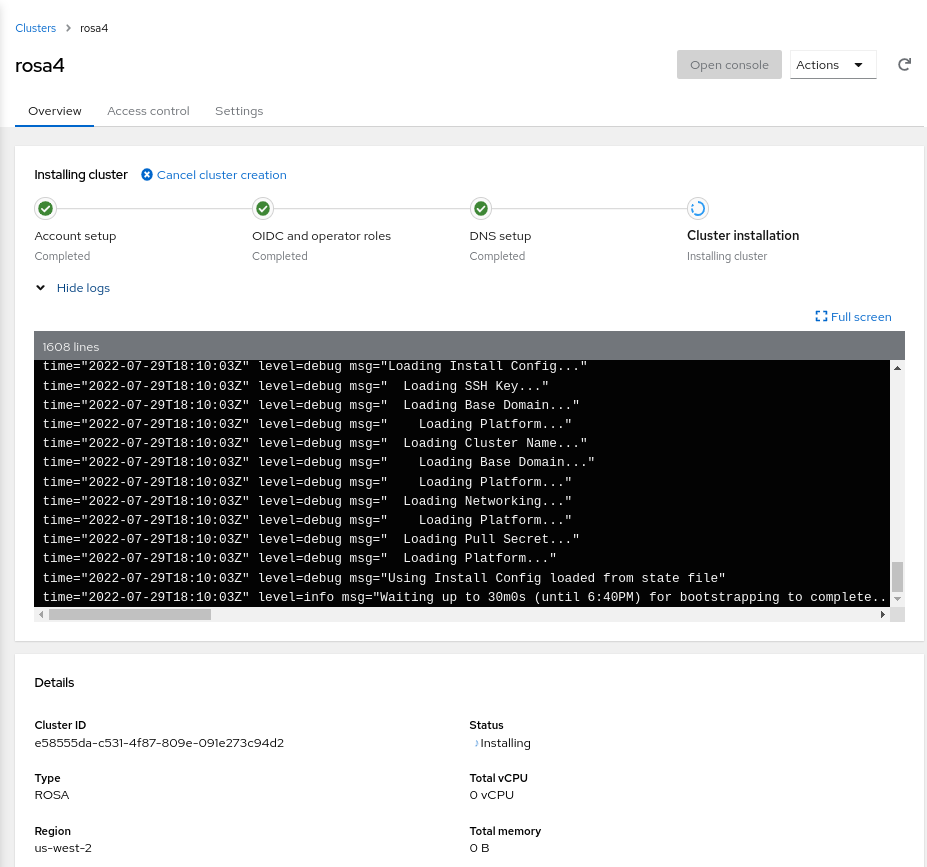

**Summary**: Descriptions and simple scripts for supported ways to deploy OpenShift on Amazon Web Services - ROSA, IPI and UPI.


## Overview

OpenShift is Kubernetes with batteries included and verified - that is,
OpenShift is ready to run complex first- and third-party applications and
digital workloads as soon as installation is complete. For example, every
OpenShift cluster includes a software-defined network provider, a container and
source build system and artifact registry, an Internet-facing router and even a
system for maintaining and updating cluster components. Contrast this with a
cluster provisioned by upstream
[kubeadm](https://kubernetes.io/docs/setup/production-environment/tools/kubeadm/)
or even the more featureful
[kubespray](https://kubernetes.io/docs/setup/production-environment/tools/kubespray/),
where adding these and other critical features requires thoughtful and sometimes
fragile integration.

Not only does OpenShift offer a ready-to-use Kubernetes environment for
developers and operators once deployed, but deployment itself has also become
remarkably simple despite the many parts, especially when a cluster is deployed
in a public cloud provider like AWS. Gone are the days when operators and
infrastructure teams would have to pre-provision hardware and operating systems
and carefully configure and patch datacenter networks before cluster
installation could even begin. Though it's still possible to customize OpenShift
and its supporting infrastructure to your heart's content, many use cases can be
met with just the defaults, a cloud provider account and a few well-written
commands.

In this article we'll discuss three ways to deploy and run OpenShift on Amazon
Web Services (AWS), and we'll contrast these with deploying upstream Kubernetes
with kubespray. The methods are presented in order of increasing complexity and
customizability: ROSA -> IPI -> UPI -> Kubespray.

Follow along and contribute to code at
<https://github.com/joshgav/openshift-on-aws.git>.

## Contents

1. [Red Hat OpenShift Service on AWS (ROSA)](#rosa)
1. [OpenShift Installer-provisioned infrastructure](#ipi)
1. [OpenShift User-provisioned infrastructure](#upi)
1. [Kubernetes with Kubespray](#kubespray)

<a id="rosa"></a>

## ROSA: Red Hat OpenShift Service on AWS

> [Follow along with scripts](https://github.com/joshgav/openshift-on-aws/tree/main/rosa).

Let's start with the simplest option: Red Hat OpenShift Service on AWS, "ROSA".
A ROSA cluster includes deployment, configuration _and_ management of required
compute, network and storage resources in AWS as well as all the resources and
services of a OpenShift Kubernetes cluster. As opposed to other options to
follow, a ROSA environment is fully supported by Red Hat's operations teams -
open a ticket and an expert Red Hat SRE will attend to it quickly.

### Setup

At the core of the ROSA lifecycle are the [rosa
CLI](https://docs.openshift.com/rosa/rosa_cli/rosa-get-started-cli.html) tool
and the [OpenShift Cluster
Manager](https://docs.openshift.com/rosa/ocm/ocm-overview.html) (OCM) service
(UI: <https://console.redhat.com/openshift>).  Get the CLI from the
[Downloads](https://console.redhat.com/openshift/downloads) section of the Red
Hat Console (free account required) or directly from
<https://mirror.openshift.com/pub/openshift-v4/clients/rosa/latest/rosa-linux.tar.gz>.
Source is at <https://github.com/openshift/rosa>. The ROSA CLI invokes OCM
services as described at <https://api.openshift.com/>, which in turn provision
required infrastructure.

You'll need both Red Hat and AWS credentials to enable the `rosa` CLI to
provision and connect to resources. Your AWS credentials can be specified as
exported `AWS_ACCESS_KEY_ID`, `AWS_SECRET_ACCESS_KEY` and `AWS_REGION`
environment variables as
[for the AWS CLI](https://docs.aws.amazon.com/cli/latest/userguide/cli-configure-envvars.html).

To get a token to login to your Red Hat account, click "View API token" at the
bottom of the Downloads page as shown in the following screenshots, or go
straight to [the token page](https://console.redhat.com/openshift/token). On
that page click "Load token", then copy the raw token (not the `ocm` command
line) and run `rosa login --token="${your_token}"`. If successful you will see
this message (with your username of course): `"I: Logged in as 'joshgavant' on
'https://api.openshift.com'`.


To verify that you've logged in successfully to both accounts run `rosa whoami`.
If connections were successful you'll see a list of attributes about each
account.

> **Tip**: To quickly enable autocompletion for `rosa` commands in your current
  shell session run `. <(rosa completion)`.

### IAM Roles

Next you'll need to create and link AWS IAM roles defining the limited
permissions granted to the cluster manager service and Red Hat operations team
members. In the recommended "STS" mode, these roles are applied to short-lived
tokens issued to machine and human operators on demand.

The following commands grant required access to the OpenShift Cluster Manager
(OCM) and its installers. The last command creates roles to act as profiles for
the EC2 instances. By specifying `--admin` and `--mode=auto` several additional
roles will be automatically created during installation.

```bash
rosa create --yes ocm-role --admin --mode=auto --prefix="ManagedOpenShift"
rosa create --yes user-role --mode=auto --prefix="ManagedOpenShift"
rosa create --yes account-roles --mode=auto --prefix="ManagedOpenShift"
```

### Create cluster

Now that your Red Hat account is bound to your AWS account you can proceed to
create your ROSA cluster! Here we'll continue to use the rosa CLI; later we'll
mention another approach. Run the following command to create a cluster in [STS
mode](https://docs.openshift.com/rosa/rosa_getting_started/rosa-sts-getting-started-workflow.html).

```bash
CLUSTER_NAME=rosa1
rosa create --yes cluster --cluster-name "${CLUSTER_NAME}" --sts --mode=auto --watch
```

You can also interactively provide configuration options at cluster creation
time by running `rosa create cluster` and answering the prompts.

### Monitor installation

By setting the `--watch` flag in the above command installation logs will stream
to stdout and the command won't return till installation completes successfully
or fails, typically >30 minutes. You can also start watching logs anytime with
`rosa logs install --cluster ${CLUSTER_NAME} --watch`.

Finally, you can review logs and other attributes of your new cluster in the
[Red Hat Console](https://console.redhat.com/openshift). Click into it and
expand the "Show logs" section to reach a view like the following:



### Use cluster

Once ready, the easiest way to begin using your cluster immediately is to
create a one-off `cluster-admin` user as follows. Later you can allow users from
a specific OpenIDConnect (OIDC) identity provider using `rosa create
oidc-provider ...`.

```bash
## create a cluster-admin user
rosa create --yes admin --cluster "${CLUSTER_NAME}"
```

You'll need URLs to reach the API server and web console of your new cluster;
get those with `rosa list clusters`. Finally, log in to the cluster via the `oc`
CLI: `oc login --user cluster-admin --password ${admin_password}`.

### Create cluster via UI

Instead of using the `rosa` CLI, once your Red Hat and AWS accounts have been
linked as described above you can also choose to create a cluster via a guided
graphical wizard in the Console. On the [Clusters page](https://console.redhat.com/openshift)
on the Red Hat Console click "Create cluster", then on the [Cluster create
page](https://console.redhat.com/openshift/create) click "Create cluster" next
to the ROSA offering, as in the following screenshot:


Your AWS account will be listed by its ID on the first page of the wizard.
Follow the prompts to configure and install a cluster.

<a id="ipi"></a>

## Installer-provisioned infrastructure (IPI)

> [Follow along with scripts](https://github.com/joshgav/openshift-on-aws/tree/main/ipi).

Even if your cluster won't be managed by Red Hat it can still be deployed and
configured in AWS automatically with a short list of commands. This method will
set up EC2 machines and volumes and VPC networks as well as the cluster itself.
It's known as "Installer-provisioned infrastructure" (IPI); here's how
to do it.

### Setup

At the heart of IPI and other OpenShift deployment methods is the
**openshift-install** CLI tool. Download it from the [downloads
section](https://console.redhat.com/openshift/downloads#tool-x86_64-openshift-install)
of the OpenShift console, or directly from
<https://mirror.openshift.com/pub/openshift-v4/x86_64/clients/ocp/stable/openshift-install-linux.tar.gz>.
Its source is at <https://github.com/openshift/installer>. Run
`openshift-install create --help` for a list of installation steps, which by
default proceed as follows:

1. **install-config**: Generate configuration manifest for infrastructure and cluster
1. **manifests**: Generate required Kubernetes resource manifests
1. **ignition-configs**: Embed Kubernetes resource manifests in OS configuration files
1. **cluster**: Provision EC2 machines and bootstrap them with the configuration files created previously

You'll also need a **pull secret** with credentials for Red Hat's
container registries. Copy this from
<https://console.redhat.com/openshift/downloads#tool-pull-secret>.

A **SSH key pair** is required for access to provisioned machines; you'll need
to provide its public key to the installer and save the private
key for access. You can copy an existing key from (for example)
`~/.ssh/id_rsa.pub` or create a new one in a secure place using (for example)
`ssh-keygen -t rsa -b 4096 -C "user@openshift" -f "./id_rsa" -N ''`.
Copy the contents of the `*.pub` file as the value of `SSH_PUBLIC_KEY` below and
save the private key for later.

Finally, to be able to access your cluster's API server and web console by name
you'll need an AWS **Route53 public hosted zone** for your cluster's base domain
name. For example, I delegate a domain named `aws.joshgav.com` from my registrar GoDaddy
to a new AWS Route53 zone, see following screenshots. Specifically, after
creating the Route53 zone I create NS records for `aws` in the parent
`joshgav.com` zone at GoDaddy pointing to the name servers selected by Route53. More
details [from RedHat
here](https://docs.openshift.com/container-platform/4.10/installing/installing_aws/installing-aws-account.html#installation-aws-route53_installing-aws-account)
and [from AWS
here](https://docs.aws.amazon.com/Route53/latest/DeveloperGuide/CreatingNewSubdomain.html).


### Create cluster

With these prerequisites in place, you'll use `openshift-install create ...` to
manage phases of the installation process. An automatable approach is to define
the desired config of your cluster in a file named `install-config.yaml`, put it
in a directory `${WORKDIR}` and run the installer in the context of that
directory like so: `openshift-install create cluster --dir ${WORKDIR}`.
For example, following is a template `install-config.yaml` file; use your own values
for `OPENSHIFT_PULL_SECRET`, `YOUR_DOMAIN_NAME` and `SSH_PUBLIC_KEY` established
above.

> The schema for `install-config.yaml` is in
  <https://github.com/openshift/installer/blob/master/pkg/types/installconfig.go>.

```yaml
apiVersion: v1
metadata:
  name: ipi
baseDomain: ${YOUR_DOMAIN_NAME}
controlPlane:
  architecture: amd64
  hyperthreading: Enabled
  name: master
  platform: {}
  replicas: 3
compute:
- architecture: amd64
  hyperthreading: Enabled
  name: worker
  platform: {}
  replicas: 3
networking:
  networkType: OVNKubernetes
  clusterNetwork:
  - cidr: 10.128.0.0/14
    hostPrefix: 23
  machineNetwork:
  - cidr: 10.0.0.0/16
  serviceNetwork:
  - 172.30.0.0/16
platform:
  aws:
    region: us-east-1
publish: External
pullSecret: '${OPENSHIFT_PULL_SECRET}'
sshKey: '${SSH_PUBLIC_KEY}'
```

### Monitor installation

Cluster installation will take 30 minutes or more. Watch logs stream to stdout
following the `openshift-install create cluster` command, run `openshift-install wait-for install-complete`,
or tail the `.openshift_install.log` file in the installation working directory
to track progress of infrastructure and cluster installation.

Internally, `openshift-install` deploys infrastructure as described in [these
Terraform configs](https://github.com/openshift/installer/tree/master/data/data),
and many log entries come from Terraform.

### Use cluster

A username and password for your cluster will be in the final lines of the
install log, either on stdout or in the `.openshift_install.log` file in the
working directory. In addition, a "kubeconfig" file and the kubeadmin user's
password are saved in the `auth` directory of the installation dir. Login to
your cluster using one of the following mechanisms:

```bash
## using kubeconfig with embedded certificate
export KUBECONFIG=temp/_workdir/auth/kubeconfig

## using username and password
oc login --user kubeadmin --password "$(cat temp/_workdir/auth/kubeadmin-password)"

## verify authorization
oc get pods -A
```

<a id="upi"></a>

## User-provisioned infrastructure (UPI)

> [Follow along with scripts](https://github.com/joshgav/openshift-on-aws/tree/main/upi).

Though the easiest way to get started with OpenShift on AWS is with ROSA or
installer-provisioned infrastructure (IPI), Red Hat also enables you to deploy
and configure your own cloud infrastructure - machines, networks, and storage -
and provision a cluster on those via a method known as "user-provisioned
infrastructure" or UPI.

### Setup

Like IPI installations, UPI installations use `openshift-install` and the other
prerequisites to generate resource manifests and OS configuration files. Unlike
IPI though, it's up to the user to configure machines and supply these files to
them when needed. For example, in AWS this is often accomplished by putting
configurations in a S3 bucket and asking machines to retrieve them from the
bucket's URL on startup.

### Create cluster

To guide users in provisioning their own infrastructure Red Hat provides a set
of CloudFormation templates reflecting good patterns for OpenShift clusters; these
templates are available
[here](https://github.com/openshift/installer/tree/master/upi/aws/cloudformation)
and the example which accompanies this article uses them.

Creating a UPI cluster in AWS follows these high-level steps:

1. Initialize Kubernetes manifests and OS configurations with `openshift-install`
1. Deploy AWS networks and machines using recommended CloudFormation templates
   or equivalent mechanisms, bootstrapping machines from generated configurations
1. Await completed installation using `openshift-install`

The AWS resources recommended for OpenShift include a VPC and subnets, a DNS
zone and records, load balancers and target groups, IAM roles for EC2 instances,
security groups and even an S3 bucket. Several kinds of cluster nodes are also
included - bootstrap, control plane and worker. The bootstrap machine starts
first and installs the production cluster on the other machines.

Full instructions for AWS UPI are
[here](https://docs.openshift.com/container-platform/4.10/installing/installing_aws/installing-aws-user-infra.html).

### Monitor installation

Once EC2 instances have started and installation of bootstrap and production
clusters has begun, you can monitor progress using `openshift-install wait-for
[install-complete | bootstrap-complete]` in your working directory. As with
other methods installation will probably take more than 30 minutes.

One step in cluster provisioning is intentionally difficult to automate -
approving Certificate Signing Requests (CSRs) for nodes. Ideally an
administrator should verify the provenance of a CSR is the expected node prior
to approving the request. You can check if CSRs are awaiting approval with `oc
get csr`. Approve all pending requests with something like the following:

```bash
csrs=($(oc get csr -o json | jq -r '.items[] | select(.status == {}) | .metadata.name'))
for csr in "${csrs[@]}"; do
    oc adm certificate approve "${csr}"
done
```

In the sample scripts which accompany this article this check runs in the
background while the cluster is being provisioned so that CSRs are immediately
approved.

### Use cluster

With UPI you don't use the `openshift-install create cluster` command; instead
run `openshift-install wait-for install-complete` after the installation process
has started. Like with IPI you can monitor stdout of this command and/or the
`.openshift_install.log` file for info on progress of cluster installation. When
the cluster is ready, log in as above with `oc login` as the kubeadmin user with
the password in `${workdir}/auth/kubeadmin-password`, or set your KUBECONFIG env
var to the path `${workdir}/auth/kubeconfig`.

Once ready reach the console of your cluster at
`https://console-openshift-console.apps.${CLUSTER_NAME}.${BASE_DOMAIN}/`.

<a id="kubespray"></a>

## Kubespray

> [Follow along with scripts](https://github.com/joshgav/openshift-on-aws/tree/main/kubespray).

The previous sections described how to deploy OpenShift, Red Hat's Kubernetes
distribution, on Amazon Web Services with various levels of support and
automation for provisioning and operation. In this section we'll deploy upstream
Kubernetes using [Kubespray](https://kubespray.io) to compare, contrast and
gather new ideas. Notably, kubespray's included configuration for AWS
infrastructure yields the following environment, nearly identical to that
produced by openshift-install and ROSA.


As with user-provisioned infrastructure (UPI) for OpenShift, with Kubespray the
user first installs infrastructure as they will (e.g. with Terraform or
CloudFormation) and then uses Kubespray to install a cluster on that
infrastructure. Kubespray offers Terraform configurations for deploying typical
environments in cloud providers; for this example I used the [configurations for
AWS](https://github.com/kubernetes-sigs/kubespray/tree/master/contrib/terraform/aws).

> Note: The most basic cluster installation tool is
[kubeadm](https://kubernetes.io/docs/setup/production-environment/tools/kubeadm/create-cluster-kubeadm/),
but it leaves many critical aspects of the cluster incomplete, such as a network
overlay, container registry and load balancer controller.
[Kubespray](https://kubernetes.io/docs/setup/production-environment/tools/kubespray/)
is also maintained by the Kubernetes project and provides a more complete
deployment.

## Create cluster

The last step of infrastructure provisioning creates an inventory file for
Ansible to consume to deploy cluster components. When infrastructure is deployed
and that file is ready run the main Kubespray process - an Ansible playbook -
using that inventory, e.g.: `ansible-playbook -i hosts.ini cluster.yaml`.
Customize the deployment by changing variables in inventory vars files or by
passing `-e key=value` pairs to the ansible-playbook invocation. Check out the
the `deploy-cluster.sh` script in the walkthrough for examples.

Rather than installing the Kubespray Ansible environment locally, you may prefer
to run commands in a containerized process bound to your inventory and SSH
files, for example as follows:

```bash
podman run --rm -it \
    --mount type=bind,source=kubespray/inventory/cluster,dst=/inventory,relabel=shared \
    --mount type=bind,source=.ssh/id_rsa,dst=/root/.ssh/id_rsa,relabel=shared \
        quay.io/kubespray/kubespray:v2.19.0 \
            bash

# when prompted, enter (for example):
ansible-playbook cluster.yml \
    -i /inventory/hosts.ini \
    --private-key /root/.ssh/id_rsa \
    --become --become-user=root \
    -e "kube_version=v1.23.7" \
    -e "ansible_user=ec2-user" \
    -e "kubeconfig_localhost=true"
```

### Use cluster

The Ansible variable `kubeconfig_localhost=true` indicates that a kubeconfig
file with credentials for the provisioned cluster should be written to the
inventory directory once the cluster is ready. You can use this config to
authenticate to the cluster's API server and invoke `kubectl` commands.

Initially the kubeconfig file will use an AWS-internal IP address for the
location of the API server. To manage your cluster from outside AWS you'll need
to change the server's URL to the address of your externally-accessible load
balancer (provisioned by Terraform previously). You can find the external load
balancer URL with the command `aws elbv2 describe-load-balancers --output json | jq -r '.LoadBalancers[0].DNSName'`.
Replace the server URL in the kubeconfig file with this hostname, being sure to
prepend `https://` and append `:6443/`.

Finally, set your KUBECONFIG env var to the file's path, i.e.
`export KUBECONFIG=inventory/cluster/artifacts/admin.conf`
and then run `kubectl get pods -A`. If all is well you should get a list of all
pods in the cluster.

## Conclusion

In this article and [accompanying
code](https://github.com/joshgav/openshift-on-aws.git) we've discussed and
demonstrated how to deploy an OpenShift or upstream Kubernetes cluster in AWS
using four different methods which progress from simplest with least control to
most complex yet customizable: ROSA -> IPI -> UPI -> Kubespray.

To minimize the complexity and overhead of managing your own clouds and
clusters, start with the simplest method - ROSA - and progress to others as
greater control and customization is needed.

Please provide feedback in [the
repo](https://github.com/joshgav/openshift-on-aws/) or on
[Twitter](https://twitter.com/joshugav). Thank you!
