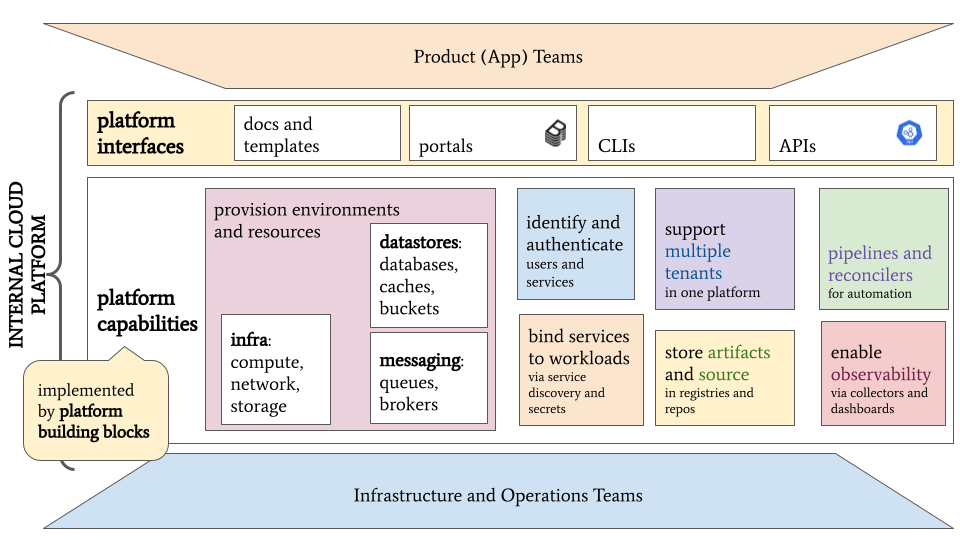

Kubecon on October 25 was a great chance to meet people and discuss emerging ideas for making cloud computing easier and more efficient for practitioners and enterprises. Cloud _platforms_ and _platform engineering_ were a popular discussion item and seem poised to finally offer a path for enterprises to maximize dev/ops cooperation and efficiency. In the interest of better understanding the requirements of such platforms for my role as lead of CNCF's Platforms working group (WG), I spent time talking to leaders and project maintainers developing building blocks for them. The WG plans to [provide a guide](https://github.com/cncf/tag-app-delivery/issues/246) on capabilities and requirements of typical platforms by the end of 2022.

In particular, the Platforms WG held an "unmeetup" (slides [here](https://docs.google.com/presentation/d/1LoAzgZe3rJuxHT86Cdj6Tv4-0XpL7nN6SMCl6oN4JbU/)) where several platform component providers introduced themselves and shared a brief technical introduction to their projects to facilitate awareness and cooperation. [Crossplane][], [Score][], [Dapr][], [Rukpak][], [VCluster][], [Kratix][], [kcp][] and [servicebinding.io][] were all represented and discussed as we seek to categorize functionality and increase compatibility to ultimately reduce complexity for platform engineers and help them succeed.

[Crossplane]: https://crossplane.io/
[Score]: https://score.dev/
[Dapr]: https://dapr.io/
[Rukpak]: https://github.com/operator-framework/rukpak
[VCluster]: https://www.vcluster.com/
[Kratix]: https://github.com/syntasso/kratix
[kcp]: https://kcp.io/
[servicebinding.io]: https://servicebinding.io/

I shared in our meetup an early attempt at categorizing some of the required functions of a cloud platform, come discuss it in [our Slack channel](https://cloud-native.slack.com/archives/C020RHD43BP):

## Notable trends

Following are some trends I noted at Kubecon relevant to platform builders:

1.  **Projects are emerging to aid in composition and abstraction of collections of
    Kubernetes resources.** Most platform engineers are happy using Kubernetes APIs
    via YAML manifests as the foundation for provisioning and managing services and
    capabilities from their platform; but most desire to provide a reduced
    abstraction over these resources for their product developers, exposing only
    those parameters relevant in their environments. While Helm and its values.yaml
    files have provided such a paradigm for a while, several more advanced projects have
    emerged that allow platform engineers to curate reduced APIs: Crossplane's
    [Composite Resources](https://crossplane.io/docs/v1.9/concepts/composition.html), Kratix's [Promises](https://kratix.io/docs/workshop/installing-a-promise), and Google's [kpt](https://kpt.dev/book/02-concepts/01-packages) are examples.

    It would be helpful to compare these composition patterns as well as related
    models from Terraform, AWS Cloud Formation and Azure Resource Manager and
    iterate forward together.

2.  **Service catalogs are emerging to gather and advertise curated services.**
    Modern digital products and services depend on many capabilities and services
    from a platform, from block and object storage to databases, identities and
    monitoring systems. These digital products may also use other line-of-business
    services.  Projects like
    [kcp](https://docs.kcp.io/kcp/main/concepts/quickstart-tenancy-and-apis/#publish-some-apis-as-a-service-provider)
    and [kubectl-bind](https://github.com/kube-bind/kube-bind) make it possible for
    platform engineers to offer self-managed and provider-managed services via
    Kubernetes APIs just like pods, volumes and network gateways. Internal service
    catalogs like [Ortellius](https://ortelius.io/) can collate line-of-business
    services. And portals like [Backstage](https://backstage.io/) can be used to
    make all these services easy to find, provision and observe on demand.
    Developers can choose services they require from catalogs and create
    reproducible environments, perhaps even in a virtual cluster like
    [vcluster](https://www.vcluster.com/).

3.  **Service binding patterns are proliferating.** As it gets easier to provision
    additional services and capabilities via Kubernetes, users need ways to retrieve
    "binding" info once a service is ready. Service "bindings" could include a URL
    for dataplane access, credentials for authorization and endpoints for logs and
    metrics. Hashicorp's [Vault Agent](https://developer.hashicorp.com/vault/docs/agent/template) and its [secrets engines](https://developer.hashicorp.com/vault/docs/secrets) are one way to get such
    bindings, but other mechanisms also exist like Crossplane's [secret stores](https://github.com/crossplane/crossplane/blob/master/design/design-doc-external-secret-stores.md#api) and
    [servicebinding.io](https://servicebinding.io/). Many tools write connection details to a resource's status or
    a named Kubernetes Secret or ConfigMap and require users to read the docs and
    learn each tool's conventions.

    It would be helpful to converge towards a standard set of bindings generators
    and standard locations to put this information in resource descriptors and
    runtime environments.

4.  **Bundlers and deployers based on OCI are popular.** Several projects now offer
    to bundle container images alongside infrastructure descriptors in OCI (Open
    Container Initiative) packages; these packages are then retrieved, unbundled and
    applied by custom controllers running in Kubernetes clusters. Examples include
    [porter][], [acorn][], Carvel's [imgpkg][] and Operator Lifecycle Manager [bundles][]. Valuably,
    the [rukpak][] project aims to offer a package manager which supports many different
    bundle formats via [Provisioners][].

    It would be great to see unbundlers and provisioners for several different
    formats in one controller like Rukpak.

[porter]: https://porter.sh/architecture/
[acorn]: https://docs.acorn.io/publishing
[imgpkg]: https://carvel.dev/imgpkg/
[bundles]: https://github.com/operator-framework/operator-registry/blob/master/docs/design/operator-bundle.md
[rukpak]: https://github.com/operator-framework/rukpak
[Provisioners]: https://github.com/operator-framework/rukpak/blob/main/docs/provisioners/overview.md

## Conclusion

Cloud platforms and platform teams promise to make cloud-native application development more efficient; and lots of tools and patterns are emerging to make platform builders' jobs easier.

Our next work in CNCF's Platforms WG aims to support these builders by defining key components of a cloud-native platform. We'll also bring together providers of similar component types and seek conventions and patterns to increase compatibility and make usage easier for platform engineers. Join us!
