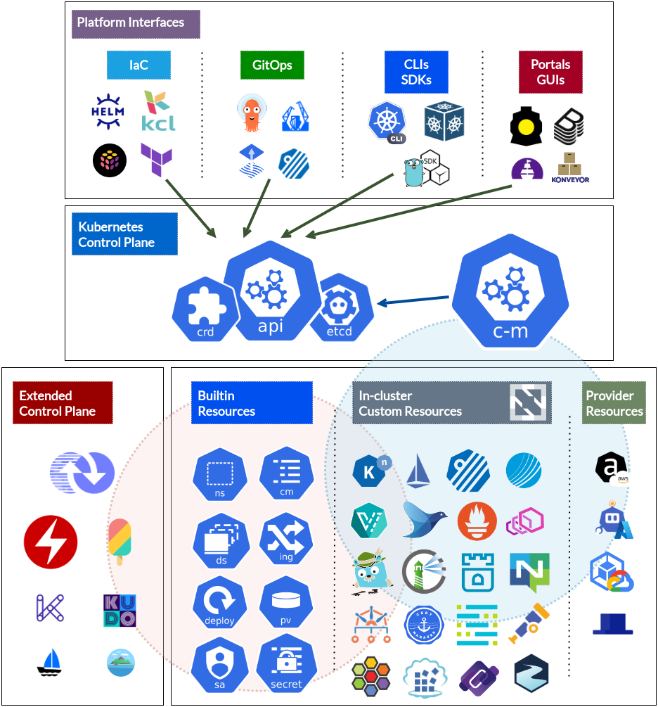

Sometimes an idea seems so obvious that it need not be stated, but then one
realizes that what's obvious to someone deep in a domain is not so obvious to
others not as deep and therefore still deserves to be stated explicitly. One
such idea is that the Kubernetes API and its ever-growing ecosystem of
extensions and extensibility frameworks is an ideal open, hybrid orchestrator
for today's emerging internal enterprise developer platforms. In this post I'll
explain why that is and what it means to adopt Kubernetes as orchestrator.

To set the stage, our industry is currently intrigued by the value of internal
cloud-like platforms that provision and manage high-level capabilities for
products and applications on demand. The term "orchestrator" is often used to
describe the central "brain" of these platforms; such an _orchestrator_ is a set
of controllers that calculate and execute workflows on demand to manage
high-level capabilities and components for applications and maintain those
capabilities in their expected, desired state.

Let's reflect further on orchestrators. In fact the term has been used for a
while to describe resource managers like Azure Resource Manager (ARM), AWS Cloud
Formation, and Hashicorp Terraform; as well as Linux container managers like
Apache Mesos, Docker Swarm and even our beloved Kubernetes. What is common to
all these? The aspect they share is that they receive workload descriptions
and capability requests centrally then coordinate and route those requests to be
fulfilled by many other resource and service providers.

For example, submit a collection of resources to Azure's Resource Manager and it
in turn will call a Storage resource provider (RP), a Database RP, and many
other Azure and third-party RPs to complete your request. Submit a collection of
resources to Hashicorp's Terraform Cloud and it uses some of its many providers
to provision those resources. Or last but not least, submit a bunch of
Kubernetes resources to a Kubernetes API server and it will delegate them to its
many built-in and custom controllers to manage.

## Kuberenetes is an orchestrator

As I've mentioned in [other
posts](https://blog.joshgav.com/posts/kubernetes-isnt-about-containers),
Kubernetes emerged as a way to coordinate and run containers across many Linux
machines; but the real value of Kubernetes is that it's a de facto open, hybrid
standard framework for software-defined infrastructure APIs - that is,
Kubernetes provides a framework for offering automated cloud infrastructure
management. Because Kubernetes offers this we can and should use it as a
framework for building platform orchestrators.

That's the central idea here so let me repeat it: **we can and should use the
Kubernetes API as a framework for building platform orchestrators.**

Why? First, Kubernetes is a de facto standard. Perhaps it took us a while to get
comfortable with it but at this point Kubernetes is familiar to most experienced
industry practitioners and tools and practices like kubectl and GitOps are
broadly used. Second, Kubernetes is an open standard - its source is licensed
openly and managed by a foundation, new specs are developed openly with input
from many companies and individuals, and managed implementations that conform to
those specs and standards are available from many providers. So building on
Kubernetes is a reliable investment. 

Third, a vast array of open source projects are embracing the pattern of
orchestrating their own individual capabilities and services via Kubernetes
controllers. Almost all CNCF projects are installed by deploying controllers and
operators in Kubernetes clusters invoking those controllers' APIs via Custom
Resource Definitions ("CRDs"). So it's natural for companies seeking to build on
open cloud-native projects to build their internal platforms as a thin layer
over these upstream implementations.

Last, and far from least, a number of frameworks are now available that make
building an orchestrator (aka a "control plane" or "internal platform") on
Kubernetes straightforward. Platform engineers don't have to rewrite or even
recompile Kubernetes to extend it, they simply need to learn and leverage
Operator Framework, Crossplane, KUDO, Kratix or tomorrow's newest controller
management framework.

Generally, the ubiquity and openness of Kubernetes and its ecosystem are key
reasons it should be your first choice as a platform orchestrators.

## What does that mean?

So what does it look like to use Kubernetes as your platform orchestrator? Let's
start with the following graphic:

First, let's again define a platform orchestrator: it's a system invoked on
demand to execute workflows to provision and/or maintain platform capabilities
and software-defined infrastructure. Kubernetes acts like an orchestrator and
runs such workflows when invoked by resource descriptions submitted to its API
server: once admitted, Kubernetes controllers discover resource types under
their management and execute tasks to bring those resources to their declared
desired state.

For example, if a `Deployment` resource is submitted to Kubernetes, a Deployment
controller ensures one pod template per desired replica is rendered and
instantiated in the cluster. If an `Ingress` resource is submitted, a network
controller ensures routing tables in nodes and cloud services are configured to
route traffic as desired.

But as we mentioned above, Kubernetes can handle much more than its built-in
resources like Pods, Ingresses and Volumes. Today's broad collection of CNCF
projects offer themselves primarily as extension controllers to Kubernetes too.
Want an Apache Spark cluster? There's a controller and resource for that. Want a
certificate management system? Try cert-manager. Looking for Kafka
infrastructure? Try Strimzi. Need a directory and OpenIDConnect? Choose from Dex
or Keycloak.

And Kubernetes usefulness as a general orchestrator and control plane doesn't
stop with cluster-internal resource types. Using the likes of [AWS Controllers
for Kubernetes](https://aws-controllers-k8s.github.io/community/), [Azure
Service Operator](https://azure.github.io/azure-service-operator/), and [Google
Cloud Config Connector](https://cloud.google.com/config-connector/docs/overview)
internal platform providers can provision and manage provider-managed services
outside of their clusters using the same paradigms as internal resources.
Projects like Crossplane have even started [a
marketplace](https://marketplace.upbound.io/providers) of such providers.

## What does that mean _to you_?

The previous section shows the robust collection of pieces and building blocks
available today for building a platform orchestrator on Kubernetes. Indeed some
intrepid organizations are already building platforms and orchestrators from
this hodgepodge of pieces - installing each controller in its own way while
evaluating and gradually establishing common standards and patterns. These
systems often use and are even sometimes equated with Kubernetes-native delivery
systems like GitOps via ArgoCD or Flux.

But the truth is another component is needed to consistently coordinate the
collection of controllers in Kubernetes that make it a complete platform; and
several frameworks are emerging and maturing to enable this. Find them described
in the above graphic as part of Kubernetes' "extended" control plane. The first
and perhaps still most popular controller manager is Red Hat's [Operator
Framework](https://operatorframework.io/), which provides not only tools to
curate and create new controllers but also a "contoller of controllers" known as
[Operator Lifecycle Manager](https://olm.operatorframework.io/) to package and
deploy controllers into clusters and keep them up to date.

Another popular controller manager framework is Upbound's
[Crossplane](https://crossplane.io/). Crossplane includes a system for managing
extension controllers - known in Crossplane as providers, as well as a
higher-level type composition system (known as "composite resource definitions"
or XRDs) to work with new resources from those providers.

Other frameworks for managing a collection of Kubernetes controllers are
[KUDO](https://kudo.dev/), [KubeVela](https://kubevela.io/) and
[Kratix](https://kratix.io/). Notably, each of these frameworks also offers a
catalog of compatible extensions, many of which are also listed in CNCF's
syndicated [ArtifactHub](https://artifacthub.io/). Catalogs for each framework
can be found via the following table.

Framework   | Catalog
------------|--------
[Operator Framework](https://operatorframework.io/) | [Operator Hub](https://operatorhub.io/)
[Crossplane](https://www.crossplane.io/) | [Upbound Marketplace](https://marketplace.upbound.io/)
[Kratix](https://kratix.io/) | [Kratix Marketpace](https://kratix.io/marketplace)
[KUDO](https://kudo.dev/) | [KUDO Operators](https://github.com/kudobuilder/operators/)
[KubeVela](https://kubevela.io/) | [KubeVela Catalog](https://github.com/kubevela/catalog)

The point of this section is to emphasize that if you use Kubernetes as an
orchestrator you should strongly consider choosing a framework to help build and
manage all those Kubernetes extensions and controllers consistently. Some
forward-thinking organizations may have started building such a framework
themselves to gather standards for deploying Helm charts, scripting CLI tools
and implementing other practices for deploying and managing controllers.  I
recommend evaluating, adopting and contributing to one of the open source
frameworks mentioned above.

## Now what?

In conclusion, Kubernetes stands waiting as a de facto open, standard, hybrid
orchestrator for your internal platforms. Choose a framework, choose some
capabilities and start building your platform on Kubernetes today!
