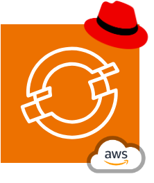

# Why Red Hat OpenShift on AWS - ROSA

For my daily research and development I primarily use the managed OpenShift
service on AWS known as [ROSA](https://aws.amazon.com/rosa/). It provides a
ready-to-use Kubernetes cluster in under an hour pre-configured with network
providers - CNI, storage providers - CSI, identity and access management (IAM),
an administrator and a developer portal and much more.

A bunch of recent and existing additions make ROSA more compelling than ever and
I want to share them here.

## 1. Hosted Control Planes

One of ROSA's top value propositions is that it relieves users of the burden of
installing, upgrading and managing cluster control planes.

Every Kubernetes cluster has three control plane nodes with hundreds of
components that orchestrate cluster operations. The control plane is overhead most users
prefer not to manage, and Red Hat OpenShift on AWS (ROSA) has always relieved
administrators of this burden. Starting shortly, control plane node instances
for ROSA clusters will be even further managed by Red Hat - the nodes won't even
show in the user's account! Known as "Hosted Control Planes", this update shifts
the control plane entirely into Red Hat's domain. With this change ROSA competes
better with AWS' own Elastic Kubernetes Service while still offering all of
OpenShift's additional benefits.

See [this AWS doc](https://docs.aws.amazon.com/ROSA/latest/userguide/rosa-deployment-options.html)
for more on hosted control planes.

## 2. AWS Controllers for Kubernetes

With ROSA it's natural to add [AWS Controller for Kubernetes
(ACK)](https://aws-controllers-k8s.github.io/community/docs/community/overview/)
and enable platform users to manage AWS-native resources in the same way as they
manage other platform capabilities.

ACK has been available via OpenShift's Operator Hub for some time. Its
controllers make it easy to manage native AWS resources via the same control
plane (aka
[orchestrator](https://blog.joshgav.com/posts/orchestrate-platforms-on-kubernetes))
alongside Kubernetes' built-in and custom resource types. See [this
tutorial](https://docs.openshift.com/rosa/cloud_experts_tutorials/cloud-experts-using-aws-ack.html)
to get started. Crossplane is another popular way to achieve this, check out
this old but still applicable [post on Crossplane on
OpenShift](https://blog.crossplane.io/crossplane-openshift-operator-cloud-native-services/).

## 3. Virtual Machine Management

With Virtualization in ROSA you can specify and run VirtualMachineInstances in
the exact same way as Pods.

A capability recently added to ROSA is the ability to run virtual machines (VMs)
via [KubeVirt](https://kubevirt.io/) on EC2 instances that include Kernel
Virtual Machine (KVM). KubeVirt recently [reached
v1.0](https://kubevirt.io/2023/KubeVirt-v1-has-landed.html) and Red Hat
OpenShift is one of few Kubernetes distros that already [fully supports
it](https://docs.openshift.com/container-platform/4.13/virt/about-virt.html).
While it may seem like this capability is well-covered by EC2 in AWS, the
benefit of Kubevirt is in using a common set of platform interfaces for
both containers and VMs. For example, Kubevirt uses Container Network
Interface (CNI), Container Storage Interface (CSI) and soon [Container Device
Interface (CDI)](https://github.com/cncf-tags/container-device-interface) the
same way as containers do.

## 4. Operator Hub

Operator Hub makes it easy to build an application or developer platform on
Kubernetes.

In fact available in any OpenShift cluster, Operator Hub leverages [Operator
Lifecycle Manager](https://olm.operatorframework.io/) to advertise and quickly
install new Kubernetes extensions, capabilities and services in a cluster, such
as OpenShift GitOps (ArgoCD), Service Mesh (Istio) and Pipelines (Tekton). Over
100 Red Hat-maintained operators can be installed as soon as the cluster is
ready, as well as nearly 200 partner-certified offerings such as PostgresQL
clusters and observability systems. With Operator Hub OpenShift becomes a
platform for building your own platform - choose the capabilities you require,
try implementations from Red Hat and partners, and finally choose and productionalize
the best implementation and experience for your internal platform.

Relatedly, don't miss [my
post](https://blog.joshgav.com/posts/orchestrate-platforms-on-kubernetes) on why
Kubernetes should be the control plane of your application platform!

## 5. Developer Hub

Developer Hub makes it easy for platform users to observe and understand the
products, components and capabilities they work with daily.

Also available for other OpenShift clusters, [Developer
Hub](https://developers.redhat.com/products/developer-hub/overview) offers a
single landing spot for developers to check on elements of the platform relevant
to their daily work. Based on CNCF's Backstage and its software catalog,
Developer Hub provides an application- and component-centric view, bringing
together in one pane of glass relevant source code repos, issue trackers,
pipeline runners, observability dashboards and more.

## A couple more

Another reason I appreciate ROSA is that it provides the same experience as I
get with OpenShift in [Azure Red Hat OpenShift
(ARO)](https://azure.microsoft.com/en-us/products/openshift) and [on
premises](https://www.redhat.com/technologies/cloud-computing/openshift/try-it)
too. After a bit of unique provisioning for each infrastructure type, I interact
in the same way with ROSA, ARO or bare metal clusters in my office closet!

Last but not least, I always appreciate that by using ROSA I'm automatically
using the battle-hardened Red Hat Enterprise Linux kernel via [Red Hat
CoreOS](https://docs.openshift.com/container-platform/4.13/architecture/architecture-rhcos.html)
to run all my systems - [Kubernetes is containers is
Linux](https://www.redhat.com/en/blog/containers-are-linux) after all.

## Summary

Ready to try ROSA and experience these great features yourself? Here are a few resources to get you started.

- Quickstart: <https://docs.openshift.com/rosa/rosa_hcp/rosa-hcp-sts-creating-a-cluster-quickly.html>
- Tutorial: <https://cloud.redhat.com/learn/getting-started-red-hat-openshift-service-aws-rosa>
- Josh's scripts and CLI walkthroughs: <https://github.com/joshgav/platform/tree/main/clusters/openshift/aws/rosa>
- Other ways to run OpenShift on AWS: <https://blog.joshgav.com/posts/openshift-on-aws>
